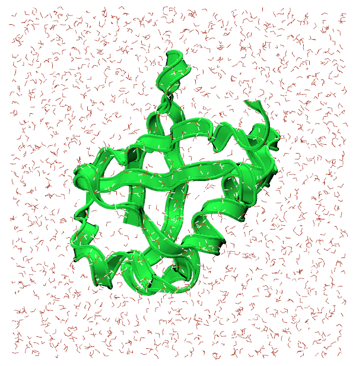

## Visualizing the system

In the NAMD tutorial, you are instructed on creating a system of ubiquitin in water to simulate. For brevity, we will use the pregenerated files in the `1-1-build/example-output/` directory. Copy `ubq_wb.psf` and `ubq_wb.pdb` to the `common` directory. 

Open VMD and load `ubq_wb.psf` and `ubq_wb.pdb` by going to File>New Molecule. You should see something similar to the image below:

I changed the representation for the protein to New Cartoon so that it is more visible.

In the `1-3-box` directory, there is a NAMD configuration file, `ubq_wb_eq.conf`, that is set to run an equilibration of ubiquitin in water. This is the .conf that we will be running on Thorny Flat.

## Transferring files to the HPC

The best way to go about transferring files to the HPC is by using Globus Connect, a service we pay for to transfer files around WVU. There is a wonderful GUI that we can use to access the filesystem on Thorny Flat, and send the necessary files to run the simulation.

Navigate to the [Globus homepage](https://www.globus.org/) and log in with your wvu credentials. This should direct you to the File Manager where the file transferring is done. 

For Globus to see the files on your computer, download [Globus Connect Personal](https://www.globus.org/globus-connect-personal) for your OS. There will be instructions to set up your computer as a Globus Endpoint.

Once complete, there will be an endpoint listed under your collections with the name provided for it:

Select it and the files locally available files will appear. Now, select the other side of the File Manager and search for: `wvu#thornydtn`. This is the name of the endpoint that will allow us to access Thorny Flat.

Navigate to to the directory containing the `namd_tutorial_files` directory in the File Manager and select the `namd_tutorial_files` directory so it is highlighter blue. Next, on the `wvu#thornydtn` side, enter the scratch directory and then the directory bearing your wvu username.

Press the blue `start` button on the left to transfer the files to your scratch directory on Thorny Flat.

## Connecting to the cluster

Open OnDemand is an excellent user-friendly way to communicate with the cluster if you don't have a locally installed terminal.

Navigate to the [Thorny Flat OnDemand](https://ondemand-tf.hpc.wvu.edu/) page and from the drop-down menus at the top select Clusters>Thorny Flat Shell Access. This will open a shell that can be used to talk to the cluster.

## Moving around with the command line

Welcome to a command line interface (CLI)! This simple looking tool is capable of running some very powerful, diverse commands, however, you need only a few of them to submit a job to the HPC. 

The first command to use is `cd` to *change directory* from one to another. This is akin to double-clicking a folder on Windows or Mac. 

You want to use `cd` to move to the directory you transferred over with Globus. To do that, execute:

~~~
$ cd $SCRATCH
~~~
{: .language-bash}

Shell commands seen here and online often have the leading `$`. You don't need to type these in; they're only there to show that this is a shell command. Press enter to execute the command. The shell won't output anything, but you should see a change in the line the cursor is on now. The `~` that was there in the previous line has become your username; this represents your current directory. 
Also the `$SCRATCH` in the command is a variable that represents the pathway to your scrach directory. Execute the following command to get a better look at where you are:

~~~
$ pwd
~~~
{: .language-bash}

~~~
/scratch/ncf0003/
~~~
{: .output}

This command prints the full path of where you presently are. Similar to C:\Users\ncf0003\Documents on Windows.

Now, to see the contents of the directory, execute the command: `ls`.

~~~
namd-tutorial-files
~~~
{: .output}

This will output all files and directories contained in the directory.

You can see the `namd-tutorial-files` directory that you transferred with Globus. Now, execute:

~~~
$ cd namd-tutorial-files/1-3-box/
~~~
{: .language-bash}

This is the directory where you will run your first job on the HPC!

## Making a pbs script and submitting a job
To submit a job to the HPC, you need to make a script called a "pbs script". This is a list of commands understood by the computer to start running your job. 
To make your pbs script, execute the following:

~~~
$ nano pbs.sh
~~~
{: .language-bash}

The `nano` command makes a new file with the name you gave it, in this case, pbs.sh. It also opens a new window that is mostly blank with commands at the bottom. This is a text editor; think of it like notepad. You should be able to copy-paste the text fromthe box below into the Open OnDemand window.

~~~
#!/bin/bash
#PBS -q standby                # queue you're submitting to
#PBS -m ae                     # sends an email when a job ends or has an error
#PBS -M ncf0003@mix.wvu.edu    # your email
#PBS -N ubq_wb_eq              # name of your job; use whatever you'll recognize
#PBS -l nodes=1:ppn=40         # resources being requested; change "node=" to request more nodes
#PBS -l walltime=10:00         # this dictates how long your job can run on the cluster; 7:00:00:00 would be 7 days

# Load the necessary modules to run namd
module load lang/intel/2018 libs/fftw/3.3.9_intel18 parallel/openmpi/3.1.4_intel18_tm

# Move to the directory you submitted the job from
cd $PBS_O_WORKDIR              

# Pathway to the namd2 code
MD_NAMD=/scratch/jbmertz/binaries/NAMD_2.14_Source/Linux-x86_64-icc-smp/

# actual call to run namd
mpirun --map-by ppr:2:node ${MD_NAMD}namd2 +setcpuaffinity +ppn$(($PBS_NUM_PPN/2-1)) ubq_wb_eq.conf > ubq_wb_eq.log
~~~
{: .language-bash}

The top block of block of commands that begin with `#PBS` are specifying how you'd like to run your job on the cluster; you can see a brief description of what they do later in each line. Lets skip the `-q` line for now and talk about the rest of the `#PBS` lines. The `-m` and `-M` lines are about emailing you confirmation of different things happening to your job; they can be omitted if you would not like to be emailed. `-N` specifies a name for your job; it will appear when you check your job later on to see its progress. There are two lines of `-l` that inform the HPC how many compute nodes you need and for how long; these can be restricted by the queue you are trying to use in the first line.

Exit `nano` for now by pressing `Ctrl-X`, then `Enter` to save the script.  

### Queues

There are severa different queues on the HPC and their names aren't misnomers; they are lines that your job will wait in for computing time. It can be a little bit of a balancing act to determine which queue will let you use enough resources for enough time while not having to wait too long. First, to see the queues of Thorny Flat, execute:

~~~
$ qstat -q
~~~
{: .language-bash}

~~~
server: trcis002.hpc.wvu.edu
Queue            Memory CPU Time Walltime Node  Run Que Lm  State
---------------- ------ -------- -------- ----  --- --- --  -----
standby            --      --    04:00:00   --   15 136 --   E R
comm_small_week    --      --    168:00:0   --   28 202 --   E R
comm_small_day     --      --    24:00:00   --   21 529 --   E R
comm_gpu_week      --      --    168:00:0   --    8  15 --   E R
comm_xl_week       --      --    168:00:0   --    4   4 --   E R
jaspeir            --      --       --      --    0   0 --   E R
jbmertz            --      --       --      --   19   1 --   E R
vyakkerman         --      --       --      --    1   0 --   E R
bvpopp             --      --       --      --    0   0 --   E R
spdifazio          --      --       --      --    0   0 --   E R
sbs0016            --      --       --      --    0   0 --   E R
pmm0026            --      --       --      --    3   0 --   E R
admin              --      --       --      --    0   0 --   E R
debug              --      --    01:00:00   --    0   0 --   E R
aei0001            --      --       --      --    0   0 --   E R
comm_gpu_inter     --      --    04:00:00   --    0   0 --   E R
phase1             --      --       --      --    0   0 --   E R
zbetienne          --      --       --      --    0   0 --   E R
comm_med_week      --      --    168:00:0   --    5   1 --   E R
comm_med_day       --      --    24:00:00   --    0   1 --   E R
mamclaughlin       --      --       --      --    1   0 --   E R
zbetienne_small    --      --       --      --    0   0 --   E R
zbetienne_large    --      --       --      --    0   0 --   E R
alromero           --      --       --      --    8 287 --   E R
tdmusho            --      --       --      --    0   0 --   E R
cedumitrescu       --      --       --      --    0   0 --   E R
cfb0001            --      --       --      --    0   0 --   E R
chemdept           --      --       --      --    0   0 --   E R
chemdept-gpu       --      --       --      --    0   0 --   E R
be_gpu             --      --       --      --    0   0 --   E R
ngarapat           --      --       --      --    0   0 --   E R
                                               ----- -----
                                                 113  1176
~~~
{: .output}

The column on the left is the name of each queue and the other most important column is the walltime. Now, lots of these queues are owned by research groups and therefore you won't have access to (i.e., jbmertz is Blake Mertz's queue that he can dictate who can use). However, every user of the cluster has access to any queue that begins with `comm`, short for community; the names give a little description of what's unique to them. `comm_small_week` gives you access to the smallest ammount of RAM a node has and will let you run for a week. Unless you're crashing due to memory issues, you should only use the `comm_small_week`, `comm_small_day`, and `standby` queues as communnity queues based on how much walltime you need as well as the `chemdept` queue. 

~~~
server: trcis002.hpc.wvu.edu
Queue            Memory CPU Time Walltime Node  Run Que Lm  State
---------------- ------ -------- -------- ----  --- --- --  -----
standby            --      --    04:00:00   --   15 136 --   E R
comm_small_week    --      --    168:00:0   --   28 202 --   E R
comm_small_day     --      --    24:00:00   --   21 529 --   E R
chemdept           --      --       --      --    0   0 --   E R
~~~
{: .output}

The HPC has a system set up to fairly distribute time among users so even though there's 202 jobs in queue for the `comm_small_week` queue, if you haven't run a job yet this week, you will effectively hop the line and your job will run before others who have used the community queues. Also, nodes are allocated to jobs based on how much walltime they're asking to use: ask for less walltime and your job will have a better chance to start sooner. Now, a guaranteed way to start your job is by submitting to a non-community queue that has no jobs in queue such as the chemdept queue. You just need to also have access to the queue to take advantage. However, as soon as the chemistry department's nodes are done on whatever job they were assigned in the mean time, they will start work on your job. 

Getting back to your pbs script, you are looking to run on the `standby` queue since the simulation you're running is not long, and for the sake of the workshop, you want it to start quickly. 

### The rest of the pbs

Execute another `nano pbs.sh` to get back into your pbs script. 

~~~
#!/bin/bash
#PBS -q standby                # queue you're submitting to
#PBS -m ae                     # sends an email when a job ends or has an error
#PBS -M ncf0003@mix.wvu.edu    # your email
#PBS -N ubq_wb_eq              # name of your job; use whatever you'll recognize
#PBS -l nodes=1:ppn=40         # resources being requested; change "node=" to request more nodes
#PBS -l walltime=10:00         # this dictates how long your job can run on the cluster; 7:00:00:00 would be 7 days

# Load the necessary modules to run namd
module load lang/intel/2018 libs/fftw/3.3.9_intel18 parallel/openmpi/3.1.4_intel18_tm

# Move to the directory you submitted the job from
cd $PBS_O_WORKDIR              

# Pathway to the namd2 code
MD_NAMD=/scratch/jbmertz/binaries/NAMD_2.14_Source/Linux-x86_64-icc-smp/

# actual call to run namd
mpirun --map-by ppr:2:node ${MD_NAMD}namd2 +setcpuaffinity +ppn$(($PBS_NUM_PPN/2-1)) ubq_wb_eq.conf > ubq_wb_eq.log
~~~
{: .language-bash}

Beynd the `#PBS` lines, there is a line loading modules that are needed to run namd. In this particular situation, the modules will always be the same, however, when using other software on the HPC, there can be many options for different software packages. To view all the modules on the HPC, execute:

~~~
$ module avail
~~~
{: .language-bash}

This outputs every piece of software installed on the nodes on Thorny Flat; you can make use of any of these languages/codes if you'd like. For running NAMD, the modules already specified in the pbs script are good. 

Next is a command you have already used `cd` to switch directories to where you submit the job; that is what the `$PBS_O_WORKDIR` stands for. The following line is making a variable to where Blake compiled this version of NAMD. Finally you have the call to run NAMD; its much longer than running it locally, however, you only need to concern yourself with the .conf and .log files at the end of the line. 

With all the parameters set, `Ctrl-X` then `Enter` to save the pbs script, and you can submit your job by executing:

~~~
$ qsub pbs.sh
~~~
{: .language-bash}

This tells Thorny Flat that you'd like to start waiting in line for your job to run.

## Checking jobs, benchmarking, and output files

Now that you have a job submitted (and potentially already running), you can execute the following to check on your submitted jobs:

~~~
$ qstat -u ncf0003
~~~
{: .language-bash}

~~~
trcis002.hpc.wvu.edu: 
                                                                                  Req'd       Req'd       Elap
Job ID                  Username    Queue    Jobname          SessID  NDS   TSK   Memory      Time    S   Time
----------------------- ----------- -------- ---------------- ------ ----- ------ --------- --------- - ---------
569147.trcis002.hpc.wv  ncf0003     standby  ubq_wb_eq        208468     1     40       --   00:10:00 R  00:00:01

~~~
{: .output}

This gives us lots of useful information about the job you submitted. You can see the parameters you set in the pbs including the job name (Jobname), queue (Queue), number of nodes (NDS), and walltime (Req'd Time) as well as the status of the job (S) and how long it has been running (Elap Time). There are several different statuses your job can have but most common are "in queue" (Q), "running" (R), and "canceled/completed" (C). 

### Benchmarking simulations
A section of the NAMD .log file (ubq_wb_eq.log for your job here) returns benchmarking information about the system you're running; this is an estimation of how fast your job is running how you have submitted it. You can access it by executing:

~~~
$ grep Benchmark ubq_wb_eq.log
~~~
{: .language-bash}

~~~
Info: Benchmark time: 38 CPUs 0.00319642 s/step 0.0184978 days/ns 2025.13 MB memory
Info: Benchmark time: 38 CPUs 0.00319819 s/step 0.018508 days/ns 2025.13 MB memory
Info: Benchmark time: 38 CPUs 0.00224249 s/step 0.0129774 days/ns 2025.13 MB memory
Info: Benchmark time: 38 CPUs 0.00239816 s/step 0.0138783 days/ns 2025.13 MB memory
Info: Benchmark time: 38 CPUs 0.00244654 s/step 0.0141582 days/ns 2025.13 MB memory
Info: Benchmark time: 38 CPUs 0.00373922 s/step 0.021639 days/ns 2025.13 MB memory
~~~
{: .output}

Conventionally, people use nanoseconds (ns) per day to estimate the best efficiency; you can calculate ns/day by inverting the days/ns column there. For instance, the output above claims you will have 60.20548131 ns/day after averaging those outputs.

To actually produce a curve for benchmarking, you would need to run your job with different numbers of nodes (usually 1, 2, 4, and 8). The plot below is an example of a typical benchmarking curve:

The red line represents perfect scaling based on the simulation using only one node. From there you can see that the actual number of ns/day achieved by the cluster is less than perfect; this is inherent in how the computer functions. This can be plotted another way by looking at how close the simulation is to achieving perfect scaling:

Now, with efficieny on the y-axis, perfect scaling becomes a horizontal line at 100% and you can see how well each number of nodes is performing. Generally, you want ~70% efficieny so you could use 4 nodes in this little example.

### Output files

Run another `qstat -u ncf0003`, and your job is probably done! There are several files created (not just by NAMD) when running a job. Run `ls` and you should see two files ending in a long string of numbers.

~~~
example-output                                            ubq_wb_eq.conf   ubq_wb_eq.coor.BAK  ubq_wb_eq.e569149  ubq_wb_eq.restart.coor      ubq_wb_eq.restart.vel.old  ubq_wb_eq.vel      ubq_wb_eq.xsc.BAK
FFTW_NAMD_2.14_Linux-x86_64-MPI-smp-openmpi-tf_FFTW3.txt  ubq_wb_eq.conf~  ubq_wb_eq.dcd       ubq_wb_eq.log      ubq_wb_eq.restart.coor.old  ubq_wb_eq.restart.xsc      ubq_wb_eq.vel.BAK  ubq_wb_eq.xst
pbs.sh                                                    ubq_wb_eq.coor   ubq_wb_eq.dcd.BAK   ubq_wb_eq.o569149  ubq_wb_eq.restart.vel       ubq_wb_eq.restart.xsc.old  ubq_wb_eq.xsc      ubq_wb_eq.xst.BAK
~~~
{: .output}

Here, they are `ubq_wb_eq.e569149` and `ubq_wb_eq.o569149`. These files are the error and output files, respectively, produced by Thorny flat when running your job. Any output produced by your code will go in the output file and same for the error file. These are an excellent first place to look when diagnosing a problem with running on the cluster as they will catch anything that goes wrong with running on the cluster. If you're however having problems with running NAMD, that will be captured by the NAMD log file (ubq_wb_eq.log for this job) and those should be diagnosed as you would any other simulation.

## Visualizing and quick analysis of the trajectory
Now that your simultion should be done (check by executing `qstat -u ncf0003`), you should transfer the files back to your computer with Globus, this time clicking the transfer button on the right side to send it to your computer. 

Once the transfer is complete, you can visualize and analyze your trajectory using a tool like VMD again. First, load `ubq_wb.psf` in to VMD followed by `ubq_qb_eq.dcd` to visualize your trajectory. Here's what the final frame could look like:

 


