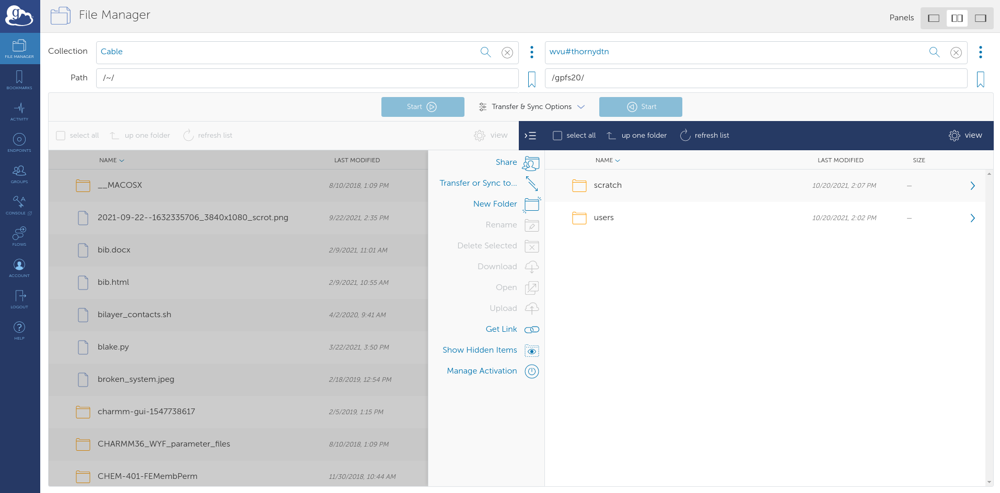

## Visualizing the system

In the NAMD tutorial, you are instructed on creating a system of ubiquitin in water to simulate. For brevity, we will use the pregenerated files in the `1-1-build/example-output/` directory. Copy `ubq_wb.psf` and `ubq_wb.pdb` to the `common` directory. 

Open VMD and load `ubq_wb.psf` and `ubq_wb.pdb` by going to File>New Molecule. You should see something similar to the image below:

I changed the representation for the protein to New Cartoon so that it is more visible.

In the `1-3-box` directory, there is a NAMD configuration file, `ubq_wb_eq.conf`, that is set to run an equilibration of ubiquitin in water. This is the .conf that we will be running on Thorny Flat.

## Transferring files to the HPC

The best way to go about transferring files to the HPC is by using Globus Connect, a service we pay for to transfer files around WVU. There is a wonderful GUI that we can use to access the filesystem on Thorny Flat, and send the necessary files to run the simulation.

Navigate to the [Globus homepage](https://www.globus.org/) and log in with your wvu credentials. This should direct you to the File Manager where the file transferring is done. 

For Globus to see the files on your computer, download [Globus Connect Personal](https://www.globus.org/globus-connect-personal) for your OS. There will be instructions to set up your computer as a Globus Endpoint.

Once complete, there will be an endpoint listed under your collections with the name provided for it:

Select it and the files locally available files will appear. Now, select the other side of the File Manager and search for: `wvu#thornydtn`. This is the name of the endpoint that will allow us to access Thorny Flat.

Navigate to to the directory containing the `namd_tutorial_files` directory in the File Manager and select the `namd_tutorial_files` directory so it is highlighter blue. Next, on the `wvu#thornydtn` side, enter the scratch directory and then the directory bearing your wvu username.

Press the blue `start` button on the left to transfer the files to your scratch directory on Thorny Flat.

## Connecting to the cluster

Open OnDemand is an excellent user-friendly way to communicate with the cluster if you don't have a locally installed terminal.

Navigate to the [Thorny Flat OnDemand](https://ondemand-tf.hpc.wvu.edu/) page and from the drop-down menus at the top select Clusters>Thorny Flat Shell Access. This will open a shell that can be used to talk to the cluster.

## Moving around with the command line

Welcome to a command line interface (CLI)! This simple looking tool is capable of running some very powerful, diverse commands, however, you need only a few of them to submit a job to the HPC. 

The first command to use is `cd` to *change directory* from one to another. This is akin to double-clicking a folder on Windows or Mac. 

You want to use `cd` to move to the directory you transferred over with Globus. To do that, execute:

~~~
$ cd $SCRATCH
~~~
{: .language-bash}

Shell commands seen here and online often have the leading `$`. You don't need to type these in; they're only there to show that this is a shell command. Press enter to execute the command. The shell won't output anything, but you should see a change in the line the cursor is on now. The `~` that was there in the previous line has become your username; this represents your current directory. Execute the following command to get a better look at where you are:

~~~
$ pwd
~~~
{: .language-bash}

~~~
/scratch/ncf0003/
~~~
{: .output}

This command prints the full path of where you presently are. Similar to C:\Users\ncf0003\Documents on Windows.

Now, to see the contents of the directory, execute the command: `ls`.

~~~
namd-tutorial-files
~~~
{: .output}

This will output all files and directories contained in the directory.

You can see the `namd-tutorial-files` directory that you transferred with Globus. Now, execute:

~~~
$ cd namd-tutorial-files/1-3-box/
~~~
{: .language-bash}

This is the directory where you will run your first job on the HPC!

## Making a pbs script and submitting a job
To submit a job to the HPC, you need to make a script called a "pbs script". This is a list of commands understood by the computer to start running your job. 
To make your pbs script, execute the following:

~~~
$ nano pbs.sh
~~~
{: .language-bash}

The `nano` command makes a new file with the name you gave it, in this case, pbs.sh. It also opens a new window that is mostly blank with commands at the bottom. This is a text editor; think of it like notepad. 

~~~
#!/bin/bash
#PBS -q standby             # queue you're submitting to
#PBS -m ae                  # sends an email when a job ends or has an error
#PBS -M ncf0003@mix.wvu.edu # your email
#PBS -N ubq_wb_eq           # name of your job; use whatever you'll recognize
#PBS -l nodes=1:ppn=40      # resources being requested; change "node=" to request more nodes
#PBS -l walltime=10:00      # this dictates how long your job can run on the cluster; 7:00:00:00 would be 7 days

module load lang/intel/2018 libs/fftw/3.3.9_intel18 parallel/openmpi/3.1.4_intel18_tm

cd $PBS_O_WORKDIR

MD_NAMD=/scratch/jbmertz/binaries/NAMD_2.14_Source/Linux-x86_64-icc-smp/

mpirun --map-by ppr:2:node ${MD_NAMD}namd2 +setcpuaffinity +ppn$(($PBS_NUM_PPN/2-1)) ubq_wb_eq.conf > ubq_wb_eq.log
~~~
{: .language-bash}

## Checking jobs, benchmarking, and output files

## Visualizing and quick analysis of the trajectory


