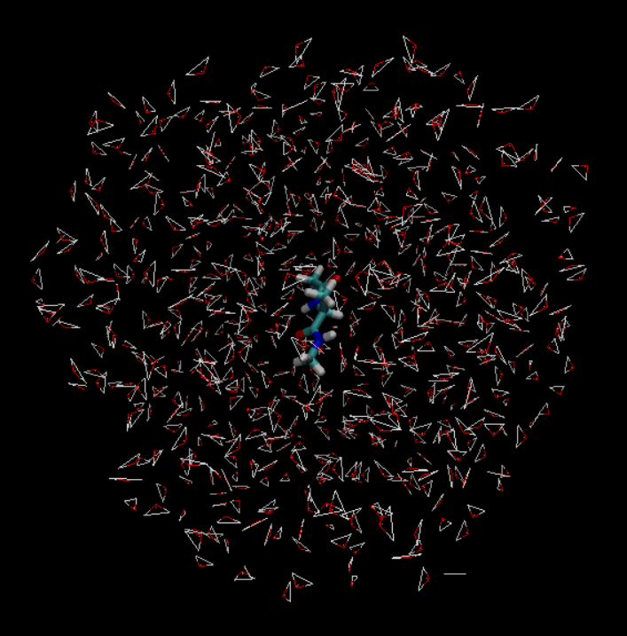

## The Ground work
We are using the Alanine dipeptide tutorial in AMBER . The first step of which is to use tleap to make the system. This is done using the PBS script below. 

~~~
#!/bin/bash
#PBS -N tleap_di-ala
#PBS -m abe
#PBS -q standby
#PBS -l nodes=1:ppn=1

module load atomistic/amber/20_gcc93_serial
# we only need to run this on one core so no need to waste resources
cd $PBS_O_WORKDIR
$AMBERHOME/bin/tleap -f make_system.txt
# abmer home is where all the flies for amber are then we find the binary for tleap
# the -f option allows us to run the make_system.txt
~~~

{: .language-bash}

This is in the folder named `01_make_system` after entering the directory  type `qsub make_system.pbs` in the command line to run the code.   

# Minimization
Go into the `AMBER` and then move into the `01_make_system` directory. There is the file called make system. Use `qsub make_system.pbs` This will take about 1min or so to run. If we look into the folder we can see that it produced the pram7 , rst7 and the leap.log files(look in the output file if you did not run the script), and we can load this into VMD so see the peptide in water. To view the simulation we have to load the pram7 as AMBER7 Parm and the rst as AMBER restart. The molecule should look kinda like this. 

To get your VMD window to look like this change add a representation to and then change the selection from `all` to `not water`. From there we use the `licorice` . 

We run the mininzation next this again for this system type the following in the termial. 

~~~
cd ../02-min
ls 
~~~
{: .language-bash}

the ouput should look like this. 

~~~
01_Min.in  02-min.pbs  example_run  parm7  rst7
~~~
{: .language-bash}

Lets take a look inside of the pbs code used to run the mininmazation
~~~
#!/bin/bash
#PBS -N 02_min
#PBS -m abe
#PBS -q standby
#PBS -l nodes=1:ppn=1

module load atomistic/amber/20_gcc93_serial
# we only need to run this on one core so no need to waste resources
cd $PBS_O_WORKDIR
# we will run this on one core and one node with sander because the PME will not work with
# any change of peridoic boundries
 $AMBERHOME/bin/sander -O -i 01_Min.in -o 01_Min.out -p parm7 -c rst7 -r 01_Min.ncrst -inf 01_Min.mdinfo# here is the flagg
# -O : overwirte any files with the same name
#-i : input config 01_Min.in
#-o : the output log of the sim. 01_Min.out
#-p : the parameter file parm7
#-c : the cordiante file rst7
#-r : the file to restart from 01_Min.ncrst
#-inf : The infroamtion file
~~~
{: .language-bash}

## Heating 

The information for benchmarking an amber simualtion can be found in the. We have not yet prodcued a trajectory file yet. The heating file will be the first file which we get do dynamics. After we move to the Heating directory we can type the `qsub 03-heat.in` . This will heat the system slowly to the final tempature. By doing this the velcoity of all the atoms slowly increase.

Looking at the PBS code for this you will notice that it looks a lot like the for of min.

~~~
#!/bin/bash
#PBS -N 03_heat
#PBS -m abe
#PBS -q standby
#PBS -l nodes=1:ppn=1

module load atomistic/amber/20_gcc93_serial
# we only need to run this on one core so no need to waste resources
cd $PBS_O_WORKDIR
# we will run this on one core and one node with sander because the PME will not work with
# any change of peridoic boundries
$AMBERHOME/bin/sander -O -i 02_Heat.in -o 02_Heat.out -p parm7 -c 01_Min.ncrst -r 02_Heat.ncrst -x 02_Heat.nc -inf 02_Heat.mdinfo
# -x : the output trajectory file
~~~
{: .language-bash}

looking into the *.mdinfo* file we will see the preformance.

~~~
-----------------------------------------------------------------------------
| Current Timing Info
| -------------------
| Total steps:     10000 | Completed:      2800 ( 28.0%) | Remaining:      7200
|
| Average timings for last     100 steps:
|     Elapsed(s) =       1.60 Per Step(ms) =      15.99
|         ns/day =      10.81   seconds/ns =    7993.30
|
| Average timings for all steps:
|     Elapsed(s) =      44.52 Per Step(ms) =      15.90
|         ns/day =      10.87   seconds/ns =    7950.20
|
| Estimated time remaining:       1.9 minutes.
 ------------------------------------------------------------------------------
~~~

The average timing for all steps is what would be used to benchmark the system. For a small system like this running the code on one core is fine , given a larger system it may be better to run with more than one core. For most systems `nodes=1:ppn=1` would be fine. The time spent in the heat ,eq ,and production steps have been shortened for time. In a real setting we would have to check if the total energy of the heating converged.

# Production 
We can finally the final step for the production as in the tutorial this one we will not run for time but take a look at the pbs codes to run the production The frist one is an example of using GPU acceraltion.
~~~
#!/bin/bash
#PBS -N 04-production
#PBS -m abe
#PBS -q comm_gpu_week
#PBS -l nodes=1:ppn=1:gpus=1
#PBS -l walltime=10:00:00
module load atomistic/amber/20_gcc93_mpic341_cuda113
cd $PBS_O_WORKDIR
# I have to add the -AllowSmallBox due to the very small size of the system but normally DO NOT
# put this in
$AMBERHOME/bin/pmemd.cuda -AllowSmallBox -O -i 03_Prod.in -o 03_Prod.out -p parm7 -c 02_Heat.ncrst -r 03_Prod.ncrst -x 03_Prod.nc -inf 03_Prod.info
~~~
{: .language-bash}

The key difference between this an the other simualtions ran so far is that we are running this with pmemd.cuda instead of sander. We can do that beacuse the system should have by this point have its PBC boundry be stabel and the fluxtions of the box will be small. AMBER is really good at using Cuda cores, and the  requried cores `#PBS -l nodes=1:ppn=1:gpus=1` will be effeceint for most systems. 

When running the `pmemd.cuda` line here it turns out that the system we use is really to small to be done with GPU acceraltion. We will have to run this using the regular `pmemd` binary instead. 

~~~
| ERROR:   max pairlist cutoff must be less than unit cell max sphere radius!
~~~

I ran it again with:

~~~
#!/bin/bash
#PBS -N 04-production
#PBS -m abe
#PBS -q comm_small_day
#PBS -l nodes=1:ppn=1
module load atomistic/amber/20_gcc93_mpic341
cd $PBS_O_WORKDIR
# put this in
$AMBERHOME/bin/pmemd -O -i 03_Prod.in -o 03_Prod.out -p parm7 -c 02_Heat.ncrst -r 03_Prod.ncrst -x 03_Prod.nc -inf 03_Prod.info
# ther is no cuda on this the pairlist gets to small for pmemd.cuda
~~~
{: .language-bash}

When doing the simulation on the GPU the total estimated time to run the producation was only 35 mintues, but when we change over no cuda code the time changed to 18hours. This gose to show how powerful a GPU can be. 

**NOTE:Amber NetCdf is not able to be loaded in the windows vesrsion of VMD. Due to time learing to use cpptraj is skipped but the manual has tons of good examples and is very well written.**

